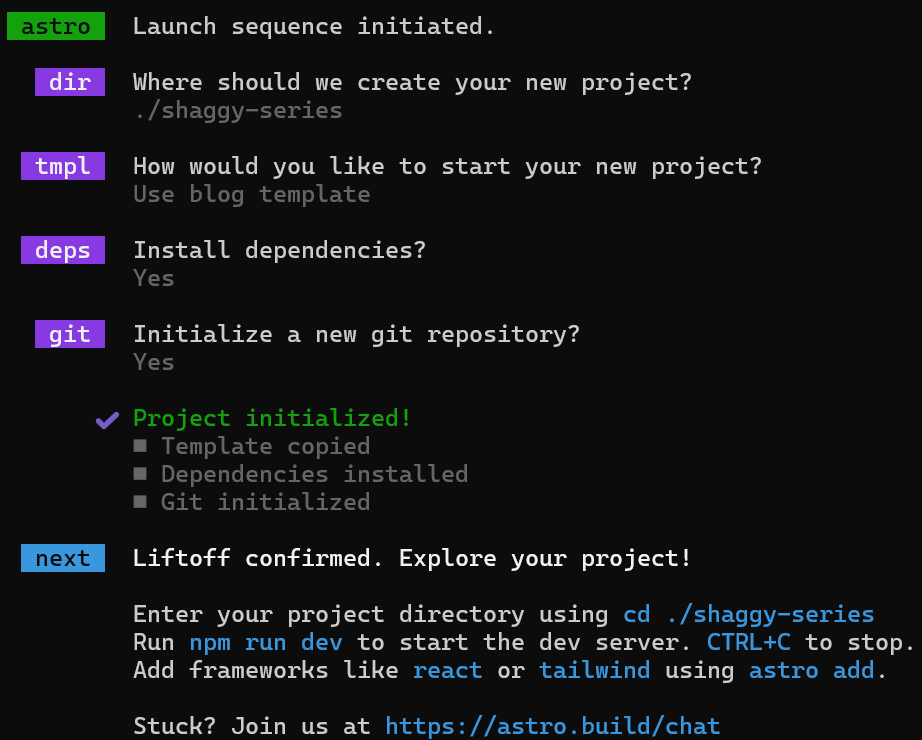
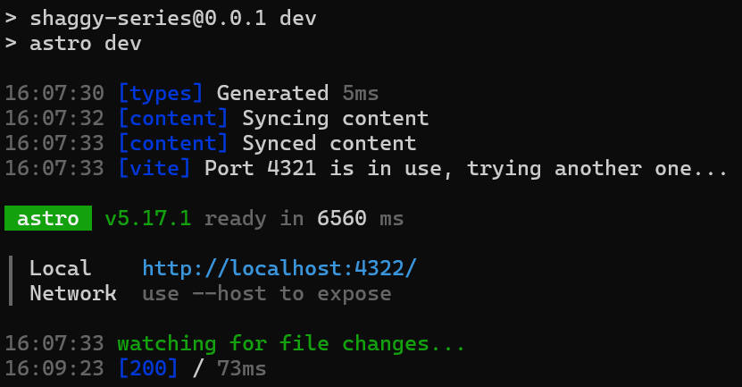

## 從前從前有一個無名小站，現在現在有一個 Astro
之前都使用 Notion 在記錄筆記、心情，但 Notion 是一個筆記取向的平台， SEO 的效果很差，所以決定來架一個 blog 來整理這些內容。Blog 的平台很多，WordPress, Medium, Hugo... 有太多太多的平台可以選擇，直到最後我遇到 <a href="https://astro.build/" target="_blank">Astro</a>。

Astro 是一個以內容為中心的框架，支援 React 與 Markdown，速度快且 SEO 體驗好，這些都是我選擇 Astro 的原因。如果你也在找一個自架 Blog 框架，也許可以跟我一起踏入這個 Astro 副本，那就打吧！

開始使用 Astro 以後，發現有關中文的內容實在好少，雖然這不影響我最後把 Blog 架起來，但如果有人願意用中文寫下筆記，我想應該有部分的人用得上吧？(雖然現在大家好像都直接問 GPT 就是了...)

### Install Astro
```
# create a new project with npm
npm create astro@latest
```

這邊可以一路依照指示按 Enter 就好，其中 dir 的設定我是輸入 "." 設定在根目錄，看到畫面顯示出最下面這一段後依照指示啟動專案。
```
cd ./shaggy-series
npm run dev
```

成功跑起來後就可以依照終端機給的 Local 網址，訪問你的 blog 囉！

接下來可以選一個平台來運行你的 Astro，我這邊是選擇我熟悉的 <a href="https://vercel.com/" target="_blank">Vercel</a>。直接把專案 push 上 GitHub，在 Vercel 連結好 GitHub，可以直接無痛部署。

<pre>Add New Project -> Choose Git Repository Click Import -> Done</pre>

Vercel 會直接幫你選擇最適合的環境部署，如果沒有選到 Astro，在 Application Preset 這邊手動選擇 Astro，除非你有其他的 Environment Variables 要設定，剩下的直接讓 Vercel 幫你設定就好，接下來就是等 Vercel Deploy 就完成囉！祝你好運！

<blockquote>Do or do not. There is no try.</blockquote>